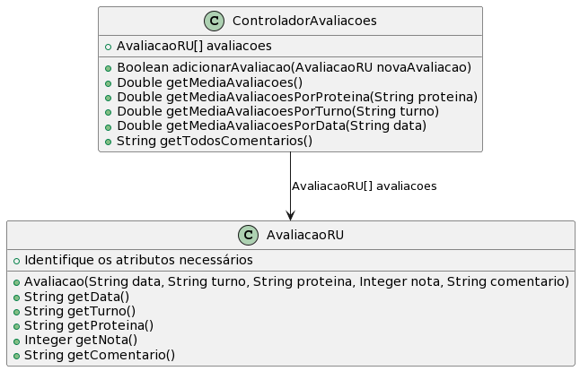

# Sistema de Avaliação do RU

A ideia desta atividade é que você seja capaz de implementar as funcionalidades
básicas de um sistema de avaliação do Restaurante Universitário.

- [Requisitos](#requisitos)
- [Diagrama](#diagrama)
- [Exemplo de execução](#exemplo-de-execução)

## Requisitos

- Avaliação de uma refeição
  - A avaliação de uma refeição deve constar data, turno (almoço ou jantar), tipo de proteína (animal ou vegetal), e nota de 1 (muito ruim) a 5 (muito bom). 
  - Opcionalmente, pode ser inserido um comentário de texto
  - Se a nota for 1 ou 2, o comentário é obrigatório
  - Quando o comentário é recuperado, deve ser incluído data, turno, tipo de proteína e nota
- Controlador de avaliação
  - O controlador de avaliação deve checar se a avaliação está preenchida corretamente
  - O controlador de avaliação armazena avaliações válidas (até 50)
  - O controlador deve emitir os seguintes relatórios
    - O sistema deve calcular a média de avaliações totais (todas as datas)
    - O sistema deve calcular a média de avaliações para cada tipo de proteína
    - O sistema deve calcular a média de avaliações por turno
    - O sistema deve calcular a média de avaliações para uma data específica
    - Se para qualquer cálculo não forem achadas nenhuma avaliação, a média deve ser 0
    - O sistema deve listar os comentários de texto (incluindo data, turno, tipo de proteína e nota)

## Diagrama



## Usando arrays em Java 

Veja as seções 14.1, 14.2 e 14.3 da Apostila de Java da Alura (https://www.caelum.com.br/apostila/apostila-java-orientacao-objetos.pdf)

## Use String para armazenar as datas ("02/04/2023")

Veja como usar String e fazer comparações na seção 13.6 da Apostila de Java da Alura (https://www.caelum.com.br/apostila/apostila-java-orientacao-objetos.pdf)


## Exemplo de execução 

**TAREFA**: Implementar as classes AvaliacaoRefeicao e ControladorAvalicoes que atenda os requisitos, conforme o diagrama e o código de teste abaixo.

```java
public class Runner {

    public static void main(final String[] args) {

        ControladorAvalicoes controlador = new ControladorAvalicoes();

        AvaliacaoRU avaliacao0 = new AvaliacaoRU("01/04/2023", "almoco", "animal", 0, "");// invalida
        AvaliacaoRU avaliacao1 = new AvaliacaoRU("01/04/2023", "almoco", "animal", 3, "");
        AvaliacaoRU avaliacao2 = new AvaliacaoRU("01/04/2023", "almoco", "animal", 4, "para ficar melhor blah blah...");
        AvaliacaoRU avaliacao3 = new AvaliacaoRU("01/04/2023", "jantar", "vegetal", 5, "");
        AvaliacaoRU avaliacao4 = new AvaliacaoRU("01/04/2023", "jantar", "animal", 2, ""); // invalida
        AvaliacaoRU avaliacao5 = new AvaliacaoRU("01/04/2023", "jantar", "animal", 2, "comida fria");
        AvaliacaoRU avaliacao6 = new AvaliacaoRU("02/04/2023", "almoco", "vegetal", 5, "");
        AvaliacaoRU avaliacao7 = new AvaliacaoRU("02/04/2023", "almoco", "", 4, ""); // invalida
        AvaliacaoRU avaliacao8 = new AvaliacaoRU("02/04/2023", "almoco", "animal", 3, "");
        AvaliacaoRU avaliacao9 = new AvaliacaoRU("02/04/2023", "almoco", "animal", 3, "");
        AvaliacaoRU avaliacao10 = new AvaliacaoRU("03/04/2023", "", "animal", 3, ""); // invalida
        AvaliacaoRU avaliacao11 = new AvaliacaoRU("03/04/2023", "almoco", "animal", 3, "");
        AvaliacaoRU avaliacao12 = new AvaliacaoRU("03/04/2023", "almoco", "vegetal", 3, "");
        AvaliacaoRU avaliacao13 = new AvaliacaoRU("03/04/2023", "jantar", "vegetal", 5, "bom demais");
        AvaliacaoRU avaliacao14 = new AvaliacaoRU("03/04/2023", "almoco", "animal", 6, ""); // invalida


        // checar invalidos
        if(controlador.adicionarAvaliacao(avaliacao0)){
          System.out.println("erro - NAO deveria aceitar avaliacao0");
        }
        if(controlador.adicionarAvaliacao(avaliacao4)){
          System.out.println("erro - NAO deveria aceitar avaliacao4");
        }
        if(controlador.adicionarAvaliacao(avaliacao7)){
          System.out.println("erro - NAO deveria aceitar avaliacao7");
        }
        if(controlador.adicionarAvaliacao(avaliacao10)){
          System.out.println("erro - NAO deveria aceitar avaliacao10");
        }
        if(controlador.adicionarAvaliacao(avaliacao14)){
          System.out.println("erro - NAO deveria aceitar avaliacao14");
        }

        System.out.println("esperado = 0.0, atual = " + controlador.getMediaAvaliacoes());
        System.out.println("esperado = 0.0, atual = " + controlador.getMediaAvaliacoesPorProteina("animal"));
        System.out.println("esperado = 0.0, atual = " + controlador.getMediaAvaliacoesPorProteina("vegetal"));
        System.out.println("esperado = 0.0, atual = " + controlador.getMediaAvaliacoesPorTurno("almoco"));
        System.out.println("esperado = 0.0, atual = " + controlador.getMediaAvaliacoesPorTurno("jantar"));
        System.out.println("esperado = 0.0, atual = " + controlador.getMediaAvaliacoesPorData("02/04/2023"));
        System.out.println("esperado = , atual = " + controlador.getTodosComentarios());

        // adicionar validos
        if(controlador.adicionarAvaliacao(avaliacao1) == false){
          System.out.println("erro - deveria aceitar avaliacao1");
        }
        if(controlador.adicionarAvaliacao(avaliacao2) == false){
          System.out.println("erro - deveria aceitar avaliacao2");
        }
        if(controlador.adicionarAvaliacao(avaliacao3) == false){
          System.out.println("erro - deveria aceitar avaliacao3");
        }
        if(controlador.adicionarAvaliacao(avaliacao5) == false){
          System.out.println("erro - deveria aceitar avaliacao5");
        }
        if(controlador.adicionarAvaliacao(avaliacao6) == false){
          System.out.println("erro - deveria aceitar avaliacao6");
        }
        if(controlador.adicionarAvaliacao(avaliacao8) == false){
          System.out.println("erro - deveria aceitar avaliacao8");
        }
        if(controlador.adicionarAvaliacao(avaliacao9) == false){
          System.out.println("erro - deveria aceitar avaliacao9");
        }
        if(controlador.adicionarAvaliacao(avaliacao11) == false){
          System.out.println("erro - deveria aceitar avaliacao11");
        }
        if(controlador.adicionarAvaliacao(avaliacao12) == false){
          System.out.println("erro - deveria aceitar avaliacao12");
        }
        if(controlador.adicionarAvaliacao(avaliacao13) == false){
          System.out.println("erro - deveria aceitar avaliacao13");
        }
      
        // realizar processamentos
        System.out.println("esperado = 3.6, atual = " + controlador.getMediaAvaliacoes());
        System.out.println("esperado = 3.0, atual = " + controlador.getMediaAvaliacoesPorProteina("animal"));
        System.out.println("esperado = 4.5, atual = " + controlador.getMediaAvaliacoesPorProteina("vegetal"));
        System.out.println("esperado = 3.42, atual = " + controlador.getMediaAvaliacoesPorTurno("almoco"));
        System.out.println("esperado = 4.0, atual = " + controlador.getMediaAvaliacoesPorTurno("jantar"));
        System.out.println("esperado = 3.66, atual = " + controlador.getMediaAvaliacoesPorData("02/04/2023"));
        System.out.println("esperado = 0.0, atual = " + controlador.getMediaAvaliacoesPorData("05/04/2023"));
        System.out.println("deve imprimir 3 comentarios:\n atual = " + controlador.getTodosComentarios());


    }
}
```
