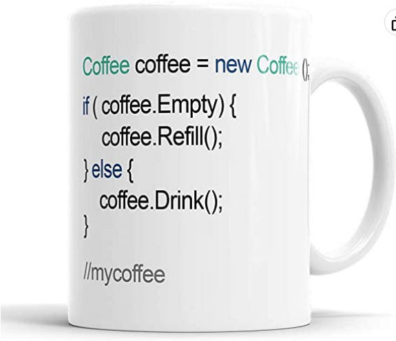

# Exemplo lúdico sobre abstração e encapsulamento

## Caneca à venda



## Análise do código

A foto ilustra um trecho de código cliente que interage com um objeto da classe `Coffee`. Qual seria o objetivo dessa parte do sistema?

```java
Coffee coffee = new Coffee();
```
O que uma classe Café representa? Café é um tipo de bebida. Então, objetos do tipo `Coffee` representam porções da bebida? Se olharmos os métodos (interface) da classe, não parece ser esse o objetivo:

```java
coffee.Empty // atributo
coffee.Refill() // método
coffee.Drink() // método
```

Mais parece que a interface se refere a um recipiente que contém a bebida. Então, uma melhor abstração seria:

```java
CoffeeMug coffeeMug = new CoffeeMug();
```

Faz mais sentido uma CANECA de café estar vazia (*empty*), ser preenchida (*refill*) ou ser consumida (*drink*). No restante da análise, usaremos a nova redação do nome da classe.

Continuando a análise, vamos à primeira estrutura condicional:

```java
if (coffeeMug.Empty) {
  //...
```

Um acesso direto a um atributo significa que o mesmo está público. Além de ser lido, pode ser alterado por outros objetos. Isso quebra o encapsulmento da classe. Uma melhor abordagem é definir um método (vamos aproveitar e corrigir a nomenclatura do método para usar a convenção [camelCase](https://www.alura.com.br/artigos/convencoes-nomenclatura-camel-pascal-kebab-snake-case)):

```java
if (coffeeMug.empty()) {
  //...
```

Há dois métodos para preencher e consumir a bebida da caneca. Imaginando que se trata de um fluxo de dados, `Refill()` deveria receber algo como parâmetro, algo a ser guardado na caneca. Já o método `Drink()` está consumindo bebida, que poderia ser retornada como parâmetro. Qual seria uma boa abstração para representar a bebida? Que tal... `Coffee`? Vamos ao exemplo completo refatorado:

```java
CoffeeMug coffeeMug = new CoffeeMug();

if (coffeeMug.empty()) {
	coffeeMug.refill(new Coffee("150ml"));
} else {
	Coffee sip = coffeeMug.drink();
}

//mycoffee
```

O comentário no final está bacana, foi mantido.