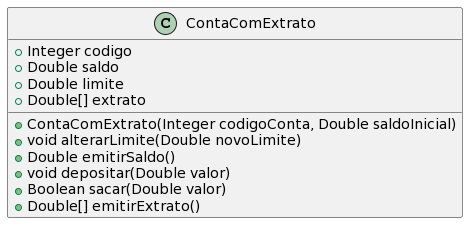

# Conta Bancária Com Extrato

A ideia desta atividade é que você seja capaz de implementar as funcionalidades
básicas de uma conta bancária com extrato.

- [Requisitos](#requisitos)
- [Diagrama](#diagrama)
- [Exemplo de execução](#exemplo-de-execução)

## Requisitos

- Conta
  - Uma conta bancária guarda o saldo e o extrato em reais de um correntista
  - A conta precisa aceitar operações de saque, depósito, alteração de limite, emitir saldo atual e emitir extrato
- Inicialização
  - O valor inicial do limite deve ser 100.00
  - Conta precisa de um número de identificação e um saldo inicial ao ser criada
  - O saldo inicial deve ser inicializado como um depósito inicial
- Saldo
  - O saldo da conta é igual ao saldo mais o limite
- Saques
  - Não deve ser possível sacar um valor negativo ou zero
  - Não deve ser possível sacar um valor que exceda o limite da conta (saldo + limite)
- Depósitos
  - Não deve ser possível depositar um valor negativo ou zero.
- Extrato
  - Depósito deve ser guardado como valor positivo
  - Saque deve ser guardado como valor negativo
  - O extrato precisa aceitar apenas 20 registros

## Diagrama



## Criando sua primeira classe em Java 

Veja as seções 4.2 a 4.6 da Apostila de Java da Alura (https://www.caelum.com.br/apostila/apostila-java-orientacao-objetos.pdf)

## Exemplo de execução 

**TAREFA**: Implementar uma classe Conta que atenda os requisitos, conforme o diagrama e o código de teste abaixo.

```java
public class Runner {

    public static void main(final String[] args) {

        ContaComExtrato minhaConta = new ContaComExtrato(1001, 200.0);
        System.out.println("saldo esperado = 300, atual = " + minhaConta.emitirSaldo());

        minhaConta.sacar(250.0);
        System.out.println("saldo esperado = 50, atual = " +  minhaConta.emitirSaldo());

        if(minhaConta.sacar(51.0)){
            System.out.println("erro = Saque autorizado");
        } else {
            System.out.println("esperado = Saque nao autorizado");
        }

        minhaConta.depositar(500.0);
        System.out.println("saldo esperado = 550, atual = " + minhaConta.emitirSaldo()); 

        if(minhaConta.sacar(150.0)){
            System.out.println("esperado = Saque autorizado"); 
        } else {
            System.out.println("erro = Saque nao autorizado"); 
        }
        
        minhaConta.alterarLimite(50.0);
        System.out.println("saldo esperado = 350, atual = " + minhaConta.emitirSaldo());
        
        if(minhaConta.sacar(400.50)){
            System.out.println("erro = Saque autorizado"); 
        } else {
            System.out.println("esperado = Saque nao autorizado"); 
        }

        minhaConta.depositar(50.0);
        System.out.println("saldo esperado = 400, atual = " + minhaConta.emitirSaldo());

        Double[] extrato = minhaConta.emitirExtrato();
        if(!extrato[0].equals(200.0)){
            System.out.println("erro - linha 0 do extrato deveria ser 200.0 ao inves de " + extrato[0]);
        }
        if(!extrato[1].equals(-250.0)){
            System.out.println("erro - linha 1 do extrato deveria ser -250.0 ao inves de " + extrato[1]);
        }
        if(!extrato[2].equals(500.0)){
            System.out.println("erro - linha 2 do extrato deveria ser 500.0 ao inves de " + extrato[2]);
        }
        if(!extrato[3].equals(-150.0)){
            System.out.println("erro - linha 3 do extrato deveria ser -150.0 ao inves de " + extrato[3]);
        }
        if(!extrato[4].equals(50.0)){
            System.out.println("erro - linha 4 do extrato deveria ser 50.0 ao inves de " + extrato[4]);
        }


    }
}
```
