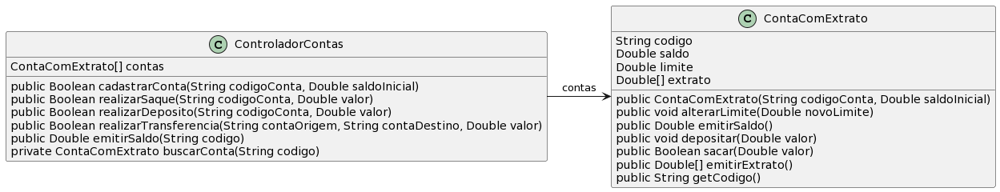

# Controlador de Conta Bancária Com Extrato

A ideia desta atividade é que você seja capaz de implementar as funcionalidades
básicas de um controlador de contas bancárias. Será reusada a classe `ContaComExtrato` do exercício do tópico [Abstração e Encapsulamento](https://github.com/ccalmendra/poo-2023-1/tree/main/abstracao-encapsulamento/conta-bancaria-extrato) -- se não fez, vá lá fazer.

- [Requisitos](#requisitos)
- [Diagrama](#diagrama)
- [Exemplo de execução](#exemplo-de-execução)

## Requisitos

- Conta com Extrato
  - Mesmos requisitos do exercício citado acima
  - Não é necessário modificar a interface (métodos)
- Controlador de contas
  - Controlador deve armazenar em array os objetos `ContaComExtrato` criados no sistema bancário
    - Duas contas não podem ter o mesmo código
  - Controlador deve ter na sua interface (métodos públicos) as seguintes operações bancárias
    - Sacar de uma conta
    - Depositar em uma conta
    - Transferir de uma conta para outra
      - Regra de saldo/limite da conta origem deve ser respeitada
    - Emitir saldo de uma conta
  - Controlador recebe apenas o código da conta, e deve buscar o objeto `ContaComExtrato` dentro do array
    - Qualquer operação só pode ser realizada se a(s) conta(s) for(em) achada(s)
    - Se uma conta não é achada, retornar `false`
    - Na emissão de saldo, se a conta não for achada, retornar `-1.0`
  - Controlador deve ter um método privado que recebe por parâmetro um código, e se a conta existir deve retornar o objeto conta
    - Esse método deve ser reusado na implementação dos demais métodos
   

## Diagrama



## Usando arrays em Java 

Veja as seções 14.1, 14.2 e 14.3 da Apostila de Java da Alura (https://www.caelum.com.br/apostila/apostila-java-orientacao-objetos.pdf)

## Tarefa

**T1**: Implementar a classe ControladorContas que atenda os requisitos, conforme o diagrama e o código de teste abaixo.

```java
public class Runner {

    public static void main(final String[] args) {

        ControladorContas controlador = new ControladorContas();

        controlador.cadastrarConta(1111,100.0);
        controlador.cadastrarConta(2222,200.0);
        controlador.cadastrarConta(3333,300.0);
        controlador.cadastrarConta(4444,400.0);
        controlador.cadastrarConta(5555,500.0);
        controlador.cadastrarConta(6666,600.0);

        if (controlador.cadastrarConta(6666,600.0) == true){
          System.out.println("01 ERRO - permitiu cadastrar codigo duplicado");
        } else {
          System.out.println("01 OK - nao permitiu cadastrar com codigo duplicado");
        }

        if (controlador.realizarSaque(4444,500.0) == true){
          System.out.println("02 OK");
        } else {
          System.out.println("02 ERRO - saque deveria ser autorizado");
        }

        if (controlador.realizarDeposito(3333,50.0) == true){
          System.out.println("03 OK");
        } else {
          System.out.println("03 ERRO - deposito deveria ser autorizado");
        }

        if (controlador.realizarSaque(7777,500.0) == true){
          System.out.println("04 ERRO - saque autorizado para conta nao existente");
        } else {
          System.out.println("04 OK - saque nao autorizado");
        }

        if (controlador.realizarTransferencia(1111,2222,40.0) == true){
          System.out.println("05 OK");
        } else {
          System.out.println("05 ERRO - transferencia deveria ser autorizada");
        }

        // checando se os saldo estao corretos
        System.out.println("06 esperado 160.0, atual = " + controlado.emitirSaldo(1111));
        System.out.println("07 esperado 340.0, atual = " + controlado.emitirSaldo(2222));
        System.out.println("08 esperado 450.0, atual = " + controlado.emitirSaldo(3333));
        System.out.println("09 esperado 0.0, atual = " + controlado.emitirSaldo(4444));
        System.out.println("10 esperado 600.0, atual = " + controlado.emitirSaldo(5555));
        System.out.println("11 esperado 700.0, atual = " + controlado.emitirSaldo(6666));
        System.out.println("12 esperado -1.0, atual = " + controlado.emitirSaldo(9999));

    }
}
```
