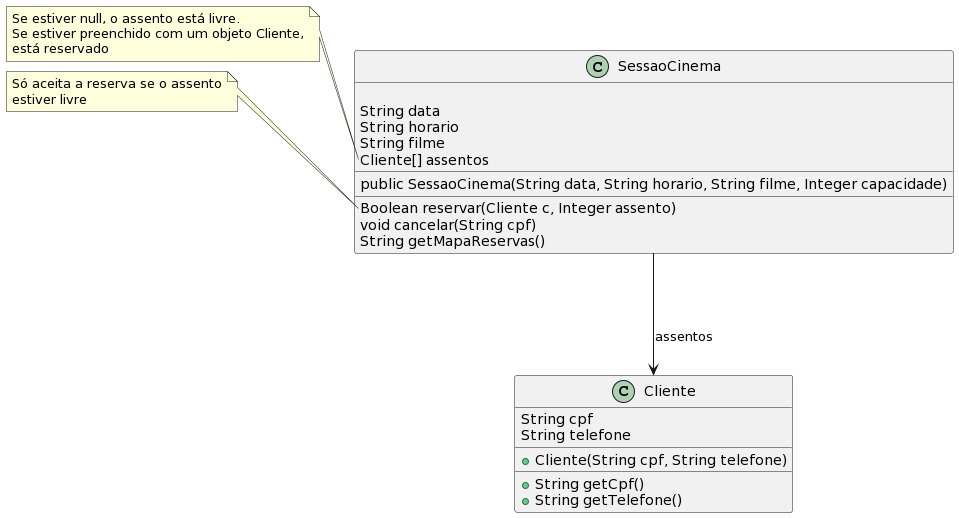

# Reserva em Sessão de Cinema

A ideia desta atividade é que você seja capaz de implementar as funcionalidades de um sistema de reserva de assentos para uma sessão de cinema. 

- [Requisitos](#requisitos)
- [Diagrama](#diagrama)
- [Tarefa](#tarefa)

- Cliente
  - Um cliente é identificado por CPF e telefone
- Sessão de cinema
  - Uma sessão possui uma data, horário, nome do filme e quantidade de assentos totais
  - Se existem assentos livres, um cliente pode reservá-lo
  - Cliente pode desistir da reserva, deixando o assento livre novamente
  - Cliente com cpf duplicado não podem ter reserva aceita
  - Deve ser possível listar o mapa de assentos indicando se está livre ou se há um cliente com reserva


## Diagrama


## Usando arrays em Java 

Veja as seções 14.1, 14.2 e 14.3 da Apostila de Java da Alura (https://www.caelum.com.br/apostila/apostila-java-orientacao-objetos.pdf)

## Tarefa

**T1**: Implementar as classes `Cliente` e `SessaoCinema` que atenda os requisitos, conforme o diagrama e o código de teste abaixo.

```java
public class Runner {

    public static void main(final String[] args) {

        SessaoCinema sessao = new SessaoCinema("27/04/2023", "15:30", "O Resgate do Programador Ryan",20);

        if(sessao.reservar(new Cliente("111.222.333-44","9090-9090"),1)){
          System.out.println("01 OK");
        } else {
          System.out.println("01 ERRO - reserva deveria ser autorizada");
        }
        if(sessao.reservar(new Cliente("222.333.111-44","8080-8080"),10)){
          System.out.println("02 OK");
        } else {
          System.out.println("02 ERRO - reserva deveria ser autorizada");
        }
        if(sessao.reservar(new Cliente("000.222.333-44","9090-9090"),10)){
          System.out.println("03 ERRO - reserva não deveria ser autorizada - assento ja reservado");
        } else {
          System.out.println("03 OK");
        }
        if(sessao.reservar(new Cliente("222.333.111-44","8080-8080"),15)){
          System.out.println("04 ERRO - reserva não deveria ser autorizada - cpf duplicado");
        } else {
          System.out.println("04 OK");
        }
        if(sessao.reservar(new Cliente("555.222.333-44","7777-9090"),20)){
          System.out.println("05 OK");
        } else {
          System.out.println("05 ERRO - reserva deveria ser autorizada");
        }
        
        sessao.cancelar("222.333.111-44"); // assento 10 liberado
        if(sessao.reservar(new Cliente("555.666.333-44","8888-8888"),10)){
          System.out.println("06 OK");
        } else {
          System.out.println("06 ERRO - reserva deveria ser aceita no assento livre");
        }

        String mapa = sessao.getMapaReservas();
        System.out.println("07 Mapa abaixo deve listar assentos reservados nas posicoes:\n" +
                           "1, 10, e 20. Demais assentos devem estar livres.\n"+
                           "Mapa gerado:\n" + mapa);
       

    }
}
```
