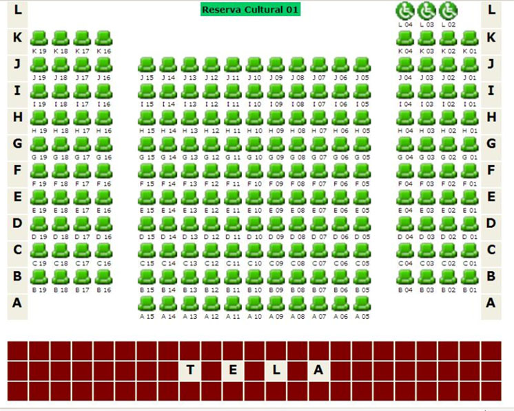

 # Reserva em Sessão de Cinema 2 (usando Mapas)

A ideia desta atividade é que você seja capaz de implementar as funcionalidades de um sistema de reserva de assentos para uma sessão de cinema usando a biblioteca `Collections` e alguma implementação de `Map`.

- [Requisitos](#requisitos)
- [Tarefa](#tarefa)

## Requisitos

- Um cliente é identificado por CPF e telefone. CPF é único e identifica individualmente cada cliente.
- Uma sessão possui uma data, horário, nome do filme e o mapa de assentos conforme a figura abaixo.
- Cada assento é identificado por um código contendo a fila (letra) e coluna (número)
  - Algumas combinações não existem, por exemplo A04, K15, A19.
  - O sistema deve rejeitar reservas para combinações não existentes
- Se um assentos está livre, cliente pode reservá-lo
  - Cliente pode desistir da reserva, deixando o assento livre novamente
  - Cliente não pode fazer duas reservas para mesma sessão
- O sistema deve listar o mapa de assentos já reservados em ordem alfabética e indicar os dados do cliente

## Usando Mapas em Java 

Veja as seções 15.11 da Apostila de Java da Alura (https://www.caelum.com.br/apostila/apostila-java-orientacao-objetos.pdf)

## Tarefa

**T1**: Implemente um Runner de acordo com os requisitos.

 - Dica: use como base o Runner do exercício [Reserva em Sessão de Cinema](../../classes-objetos/sessao-cinema/)

**T2**: Implemente os requisitos.

 - Dica 1: use um mapa com a chave sendo código do assento e o valor sendo o objeto do cliente
 - Dica 2: crie uma coleção de códigos de assento válidos para guardar o mapa completo da sala
