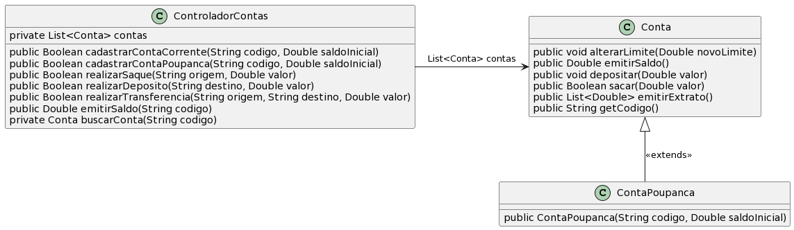

# Controlador de Contas Corrente e Poupança (usando herança)

A ideia desta atividade é que você seja capaz de implementar as funcionalidades básicas de um controlador de contas bancárias.

- [Requisitos](#requisitos)
- [Diagrama](#diagrama)
- [Tarefa](#tarefa)
- [Solução](#solução)

## Requisitos

- Conta Poupança
  - Para esse exercício, Poupança deve herdar de ContaCorrente
  - Poupança não tem limite, ou seja não deve conter nenhum atributo e o método 'alterarLimite' deve estar vazio
- Demais requisitos, ver 

## Diagrama

## Tarefa

**T1**: Implementar as classes e interface do diagrama, atendendo os requisitos. Construa seu runner, use como base a solução do exercício em 

## Solução

[Solução](solucao/)
