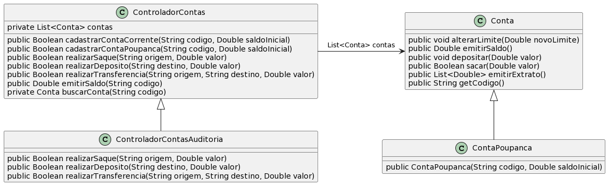

# Controlador de Contas com Auditoria (usando herança)

A ideia desta atividade é que você seja capaz de implementar as funcionalidades básicas de um controlador de contas bancárias que tem recursos de log para auditoria.

- [Requisitos](#requisitos)
- [Diagrama](#diagrama)
- [Tarefa](#tarefa)

## Requisitos

- Considere os mesmos requisitos de exercício anterior de herança [../conta-corrente-poupanca/](../conta-corrente-poupanca/)
- Controlador com auditoria
  - A nova subclasse deve logar os horários das operações de saque, depósito e transferência
  - O log deve ser exibido na saída padrão (System.out)
  - O log deve exibir se a operação foi concretizada ou não

## Diagrama

## Leituras
- Leia: https://docs.oracle.com/javase/specs/jls/se20/html/jls-15.html#jls-15.11.2
- Leia: https://docs.oracle.com/en/java/javase/20/docs/api/java.base/java/time/LocalDateTime.html#now()

## Tarefa

**T1**: Implementar as classes e interface do diagrama, atendendo os requisitos. Construa seu runner, use como base a solução do exercício em [../conta-corrente-poupanca/](../conta-corrente-poupanca/)

