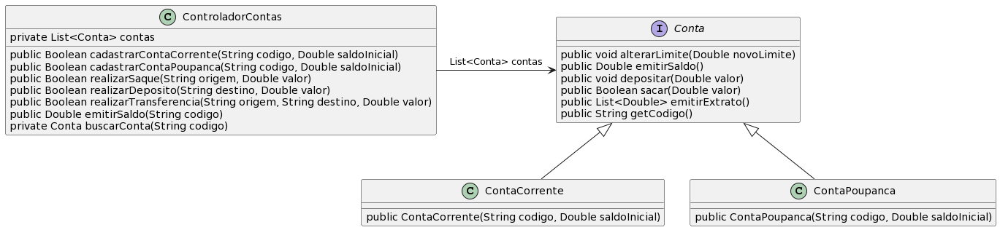

# Controlador de Contas Corrente e Poupança

A ideia desta atividade é que você seja capaz de implementar as funcionalidades básicas de um controlador de contas bancárias.

- [Requisitos](#requisitos)
- [Diagrama](#diagrama)
- [Tarefa](#tarefa)
- [Solução](#solução)

## Requisitos

- Conta Corrente
  - Uma conta corrente simples guarda o saldo em reais de um correntista
  - A conta precisa aceitar operações de saque, depósito, alteração de limite, e emitir saldo atual
  - O valor inicial do limite deve ser 100.00
  - Conta corrente precisa de um número de identificação e um saldo inicial ao ser criada
- Conta Poupança
  - Para esse exercício, apenas replique a implementação interna de ContaCorrente, com uma exceção:
    - Poupança não tem limite, ou seja não deve conter nenhum atributo e o método 'alterarLimite' deve estar vazio
- Saldo
  - O saldo da conta é igual ao saldo mais o limite
- Saques
  - Não deve ser possível sacar um valor negativo ou zero
  - Não deve ser possível sacar um valor que exceda o limite da conta (saldo + limite)
- Depósitos
  - Não deve ser possível depositar um valor negativo ou zero.
- Extrato
  - Deve guardar o extrato de depósitos e saques
- Interface Conta
  - Conta Corrente e Conta Poupança devem implementar a mesma interface Conta
- Controlador de contas
  - Controlador deve armazenar uma Lista com os objetos do tipo da interface `Conta` 
    - Duas contas não podem ter o mesmo código
  - Controlador deve ter na sua interface (métodos públicos) as seguintes operações bancárias
    - Sacar de uma conta
    - Depositar em uma conta
    - Transferir de uma conta para outra
      - Regra de saldo/limite da conta origem deve ser respeitada
    - Emitir saldo de uma conta
  - Controlador recebe apenas o código da conta, e deve buscar o objeto `Conta` dentro da lista
    - Qualquer operação só pode ser realizada se a(s) conta(s) for(em) achada(s)
    - Se uma conta não é achada, retornar `false`
    - Na emissão de saldo, se a conta não for achada, retornar `-1.0`
  - Dica: controlador deve ter um método privado que recebe por parâmetro um código, e se a conta existir deve retornar o objeto conta
    - Esse método deve ser reusado na implementação dos demais métodos


## Diagrama


## Usando listas em Java 

Veja as seções 15.1, 15.2, 15.3 e 15.4 da Apostila de Java da Alura (https://www.caelum.com.br/apostila/apostila-java-orientacao-objetos.pdf)

## Tarefa

**T1**: Implementar as classes e interface do diagrama, atendendo os requisitos.

```java
public class Runner {

    public static void main(final String[] args) {

        ControladorContas controlador = new ControladorContas();

        controlador.cadastrarContaCorrente("1111",100.0);
        controlador.cadastrarConta("2222",200.0);
        controlador.cadastrarContaPoupanca("3333",300.0);
        controlador.cadastrarConta("4444",400.0);
        controlador.cadastrarContaCorrente("5555",500.0);
        controlador.cadastrarConta("6666",600.0);

        if (controlador.cadastrarContaCorrente("6666",600.0) == true){
          System.out.println("01 ERRO - permitiu cadastrar codigo duplicado");
        } else {
          System.out.println("01 OK - nao permitiu cadastrar com codigo duplicado");
        }

        if (controlador.realizarSaque("4444",500.0) == true){
          System.out.println("02 OK");
        } else {
          System.out.println("02 ERRO - saque deveria ser autorizado");
        }

        if (controlador.realizarDeposito("3333",50.0) == true){
          System.out.println("03 OK");
        } else {
          System.out.println("03 ERRO - deposito deveria ser autorizado");
        }

        if (controlador.realizarSaque("7777",500.0) == true){
          System.out.println("04 ERRO - saque autorizado para conta nao existente");
        } else {
          System.out.println("04 OK - saque nao autorizado");
        }

        if (controlador.realizarTransferencia("1111","2222",40.0) == true){
          System.out.println("05 OK");
        } else {
          System.out.println("05 ERRO - transferencia deveria ser autorizada");
        }

        // checando se os saldo estao corretos
        System.out.println("06 esperado 160.0, atual = " + controlador.emitirSaldo("1111"));
        System.out.println("07 esperado 340.0, atual = " + controlador.emitirSaldo("2222"));
        System.out.println("08 esperado 450.0, atual = " + controlador.emitirSaldo("3333"));
        System.out.println("09 esperado 0.0, atual = " + controlador.emitirSaldo("4444"));
        System.out.println("10 esperado 600.0, atual = " + controlador.emitirSaldo("5555"));
        System.out.println("11 esperado 700.0, atual = " + controlador.emitirSaldo("6666"));
        System.out.println("12 esperado -1.0, atual = " + controlador.emitirSaldo("9999"));

    }
}
```

## Solução

[Solução](solucao/)
