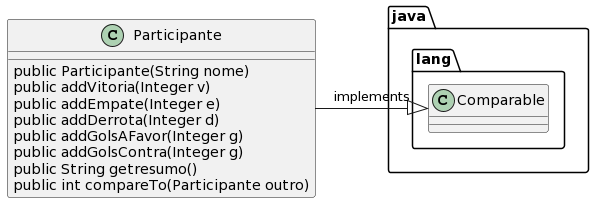

# Tabela de campeonato

A ideia desta atividade é que você seja capaz de implementar uma classe que implemente a inteface `Comparable`. Os critérios de ordenação estão abaixo.

- [Requisitos](#requisitos)
- [Diagrama](#diagrama)
- [Tarefa](#tarefa)

## Requisitos

- Participante
  - Um participante possui um nome, vitórias, empates, derrotas, gol a favor e gol contra
  - Os valores númericos iniciam zerados
  - É possível adicionar novos valores para cada um desses atributos
  - É possível retornar um resumo com nome e todos os valores númericos na mesma linha
- Critério de ordenação (quem vence o campeonato)
  - 1º critério: número de vitórias
  - Em caso de empate, 2º critério: menos derrotas
  - Em caso de empate, 3º critério: mais gols a favor
  - Em caso de empate, 4º critério: menos gols contra
  - Se todos os números estiverem iguais, fica empatado.
- Uma lista de participantes deve ser ordenável usando a função sort da API Collections (ver Apostila)


## Diagrama


## Usando a interface Comparable em Java 

Veja as seções 15.5 e 15.6 da Apostila de Java da Alura (https://www.caelum.com.br/apostila/apostila-java-orientacao-objetos.pdf)


## Tarefa

**T1**: Construa seu próprio Runner para esse exercício

```java
public class Runner {

    public static void main(final String[] args) {

        List<Participante> participantes;
        
        //... criacao dos objetos
        
        //... inclusao de valores
        
        Collections.sort(participantes)
       
        // imprimir todas as linhas dos participantes

    }
}
```
