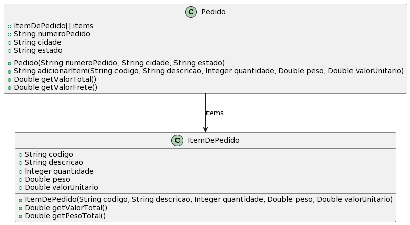

# Pedido via Internet

A ideia desta atividade é que você seja capaz de implementar as funcionalidades
básicas de um pedido pela internet. **Atenção para a nova tarefa de inserir testes no Runner**.

- [Requisitos](#requisitos)
- [Diagrama](#diagrama)
- [Exemplo de execução](#exemplo-de-execução)

## Requisitos

- Pedido
  - Um pedido possui:
    - Número de identificação
    - 1 ou mais itens do pedido
    - Cidade e estado de destino da entrega
  - Itens NÃO podem ser adicionados se:
    - Quantidade for menor ou igual a zero
    - Valor unitário for menor ou igual a zero
    - Peso unitário for menor ou igual a zero
    - Código e descrição estiverem vazios
- Item de pedido
  - Um item de pedido possui código, descrição, quantidade, peso unitário em kg, e valor unitário
- Política de frete
    - Qualquer pedido igual ou acima de R$ 1.000,00 tem frete grátis
    - Pedidos abaixo de 1.000,00, valor do frete segue a tabela:
      - Norte/Nordeste = R$ 20,00/kg
      - Centro-Oeste/Sudeste = R$ 25,00/kg
      - Sul = R$ 30,00/kg

## Diagrama


## Usando arrays em Java 

Veja as seções 14.1, 14.2 e 14.3 da Apostila de Java da Alura (https://www.caelum.com.br/apostila/apostila-java-orientacao-objetos.pdf)

## Use String

Veja como usar String e fazer comparações na seção 13.6 da Apostila de Java da Alura (https://www.caelum.com.br/apostila/apostila-java-orientacao-objetos.pdf)

## Tarefas

**TAREFA 1**: Implementar as classes Pedido e ItemDePedido que atenda os requisitos, conforme o diagrama e o código de teste abaixo.

**TAREFA 2**: Implementar um novo teste dentro do Runner de acordo com o comentário ao final.

```java
public class Runner {

    public static void main(final String[] args) {

        ItemDePedido item1 = new ItemDePedido("101010", "Pendrive", 2, 0.100, 39.90);
        System.out.println("01 valor esperado = 79.8, atual = " + item1.getValorTotal());
        System.out.println("02 peso esperado = 0.2, atual = " + item1.getPesoTotal());

        ItemDePedido item2 = new ItemDePedido("100100", "Impressora", 1, 2.950, 825.90);
        System.out.println("03 valor esperado = 825.90, atual = " + item2.getValorTotal());
        System.out.println("04 peso esperado = 2.95, atual = " + item2.getPesoTotal());
        
        Pedido p1 = new Pedido("0000123", "Belem", "PA");
        p1.adicionarItem("101010", "Pendrive", 2, 0.100, 39.90);
        p1.adicionarItem("", "Mouse", 1, 0.200, 10.90); // invalido
        System.out.println("05 valor esperado = 79.8, atual = " + p1.getValorTotal());
        System.out.println("06 frete esperado = 4.0, atual = " + p1.getValorFrete());

        Pedido p2 = new Venda("0000456", "Palmas", "TO");
        p2.adicionarItem("100100", "Impressora", 1, 2.950, 825.90);
        System.out.println("07 frete esperado = 73.75, atual = " + p2.getValorFrete());
        p2.adicionarItem("111100", "Kit Teclado/Mouse Developer", 1, 0.5, 239.90);
        System.out.println("08 frete esperado = 0.0, atual = " + p2.getValorFrete());

        //Elabore uma sequencia de instruções para criar um pedido para envio ao estado
        //de Santa Catarina (SC), com valor dos itens abaixo de R$ 1.000,00
        
        //Pedido p3 ...
 
    }
}
```
