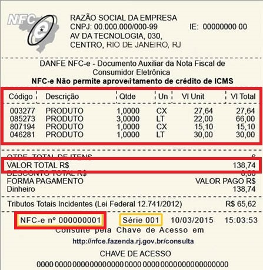

# Nota de Venda Simples

A ideia desta atividade é que você seja capaz de implementar as funcionalidades
básicas de uma venda.

- [Requisitos](#requisitos)
- [Diagrama](#diagrama)
- [Exemplo de execução](#exemplo-de-execução)

## Requisitos

- Venda
  - Uma venda tem um número de nota fiscal e 1 ou mais itens de venda
  - Itens NÃO podem ser adicionados se:
    - Quantidade for menor ou igual a zero
    - Valor unitário for menor ou igual a zero
    - Código, descrição ou unidade estiver vazio
  - Ao imprimir uma venda, cada item deve ser exibido em linha separada
  - Ao imprimir uma venda, o valor total deve ser calculado e exibido ao final
  - Ao imprimir uma venda, o número da nota deve ser exibida ao final
- Item de venda
  - Um item de venda possui código, descrição, quantidade, unidade de medida, e valor unitário

## Exemplo de nota de venda


## Diagrama


## Usando arrays em Java 

Veja as seções 14.1, 14.2 e 14.3 da Apostila de Java da Alura (https://www.caelum.com.br/apostila/apostila-java-orientacao-objetos.pdf)

## Use String

Veja como usar String e fazer comparações na seção 13.6 da Apostila de Java da Alura (https://www.caelum.com.br/apostila/apostila-java-orientacao-objetos.pdf)

## Exemplo de execução 

**TAREFA**: Implementar as classes Venda e ItemDeVenda que atenda os requisitos, conforme o diagrama e o código de teste abaixo.

```java
public class Runner {

    public static void main(final String[] args) {

        ItemDeVenda item1 = new ItemDeVenda("101010", "Suco de uva", 2.0, "UN", 3.99);
        System.out.println("esperado = 7.98, atual = " + item1.getValorTotal());
        System.out.println("esperado = \n"
                  + "101010 Suco de uva 2.0 UN 3.99 7.98\n"
                  + "atual = " + item1.imprimir());

        ItemDeVenda item2 = new ItemDeVenda("100100", "Banana prata", 0.900, "KG", 5.79);
        System.out.println("esperado = 9.18, atual = " + item2.getValorTotal());
        System.out.println("esperado = \n"
                  + "100100 Banana prata 0.9 KG 5.79 5.211\n"
                  + "atual = " + item2.imprimir());

        Venda v1 = new Venda("0000123");
        System.out.println("esperado = 0.0, atual = " + v1.getValorTotal());
        v1.adicionarItem("101010", "Suco de uva", 2.0, "UN", 3.99);
        v1.adicionarItem("100100", "Banana prata", 0.900, "KG", 5.79);
        v1.adicionarItem("111000", "Cream Cracker", 1.0, "PC", 6.95);
        System.out.println("esperado = 20.141, atual = " + v1.getValorTotal());
        System.out.println("esperado = \n"
                  + "101010 Suco de uva 2.0 UN 3.99 7.98\n"
                  + "100100 Banana prata 0.9 KG 5.79 5.211\n" 
                  + "111100 Cream Cracker 1.0 PC 6.95 6.95\n"  
                  + "Valor total 20.141\n"
                  + "Nota fiscal 0000123\n"
                  + "atual = " + v1.imprimir());

        Venda v2 = new Venda("0000456");
        // nao deve aceitar nenhum das inclusoes abaixo
        v2.adicionarItem("", "Suco de uva", 2.0, "UN", 3.99);
        v2.adicionarItem("100100", "", 0.900, "KG", 5.79);
        v2.adicionarItem("111100", "Cream Cracker", 0.0, "PC", 6.95);
        v2.adicionarItem("011011", "Detergente", 2.0, "UN", -1.0);
        v2.adicionarItem("011011", "Detergente", 2.0, "", 4.59);
        System.out.println("esperado = 0.0, atual = " + v2.getValorTotal());


    }
}
```
