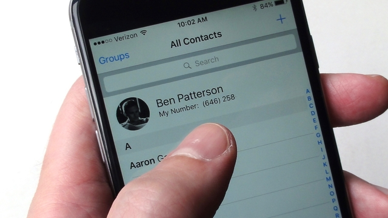

# Contato - Agenda 


O objetivo dessa atividade é implementar uma agenda que possui vários contatos e cada contato possui vários telefones. Fonte: https://github.com/profBruno-UFC-Qx/qxd0007-agenda

- [Requisitos](#requisitos)
- [Diagrama](#diagrama)
- [Exemplo de execução](#exemplo-de-execução)

## Requisitos

- Inicializar um contato
  - Para inicializar um contato você precisar informar o nome do contato.
- Inserir fones no contato
  - Um fone tem um indentificador e um número
  - Identificadores são nomes como: casa, trabalho e celular.
- Validar números de telefone
  - Processe os números de telefone para que sejem aceitos somente aqueles que tem os seguintes caracteres: ```0123456789()-```.
  - Se o usuário tentar inserir um número de telefone inválido não adcione o fone no contato.
- Adicionar contato na ageda
  - O nome do contato é seu identificador único.
  - Não deve ser possível adicionar um contato sem telefone.
  - Ao tentar adicionar outro contato na agenda com o mesmo nome, apenas os telefones no novo contato devem ser adicionados ao contato existente.
- Mostrar na agenda
  - Exibe os contatos da agenda em ordem alfabética.
- Remoção de contatos da agenda
  - Deve ser possível remover o contato ao informar o identificador único do contato.
  - Deve ser possível remover telefone do contato por meio de seu identificador único e pelo índice do telefone.
- Busca
  - Deve ser possível realizar uma busca por um padrão em todos os atributos do contato, seja por nome, identificado ou telefone.
    - Se qualquer campo do contato combinar com o padrão buscado, o contato deve ser retornado. 
      Se o usuário busca por 'maria', devem ser retornados os contatos como "maria julia", "mariana", "ana maria" etc. 
    - Também inclua na busca identificador do telefone e o número de telefone.
    - Exiba os resultados também em ordem alfabética.
- Resumo da agenda
  - Deve ser possível verificar a quantidade de telefones na agenda de cada identificador.
  - Deve ser possível verificar a quantidade de telefones a quantidade total de telefones cadastrados na agenda.

## Diagrama


## Exemplo de execução 
```java
import java.util.ArrayList;

public class Runner {

    public static void main(final String[] args) {
        
        Agenda agenda = new Agenda();
        
        Contato contato = new Contato("Adriele");
        contato.adicionarFone(new Fone(Identificador.CLARO, "(77)89085-9077"));
        contato.adicionarFone(new Fone(Identificador.TIM, "(63)61730-9301"));
        System.out.println(contato); // - Adriele [0:Claro:(77)89085-9077] [1:Tim:(63)61730-9301]
        
        Contato contato1 = new Contato("Biatriz");
        contato1.adicionarFone(new Fone(Identificador.TRABALHO, "(80)63810-9092"));
        System.out.println(contato1); // - Biatriz [0:Trabalho:(80)63810-9092]
        
        Contato contato2 = new Contato("Ariele");
        contato2.adicionarFone(new Fone(Identificador.TRABALHO, "(24)62362-1925"));
        contato2.adicionarFone(new Fone(Identificador.OI, "(79)98614-1326"));
        if(!contato2.adicionarFone(new Fone(Identificador.VIVO, "(24)62362-abc"))){
            System.out.println("fail: numero de telefone invalido"); //fail: numero de telefone invalido
        }
        System.out.println(contato2); // - Ariele [0:Trabalho:(24)62362-1925] [1:Oi:(79)98614-1326]
        
        agenda.adicionarContato(contato);
        agenda.adicionarContato(contato1);
        agenda.adicionarContato(contato2);
        System.out.println(agenda);
        /*
            - Adriele [0:Claro:(77)89085-9077] [1:Tim:(63)61730-9301]
            - Ariele [0:Trabalho:(24)62362-1925] [1:Oi:(79)98614-1326]
            - Biatriz [0:Trabalho:(80)63810-9092]
        */

        int quantidade = agenda.quantidadeDeFones(Identificador.TRABALHO);
        System.out.println("Total de telefones com o identifcador (Trabalho) é igual a " +  quantidade);
        // Total de telefones com o identifcador (Trabalho) é igual a 2

        Contato contato3 = new Contato("Biatriz");
        contato3.adicionarFone(new Fone(Identificador.OI, "(59)67638-0967"));
        contato3.adicionarFone(new Fone(Identificador.CASA, "(59)67638-0967"));
        agenda.adicionarContato(contato3);
        System.out.println(agenda);
        /*
            - Adriele [0:Claro:(77)89085-9077] [1:Tim:(63)61730-9301]
            - Ariele [0:Trabalho:(24)62362-1925] [1:Oi:(79)98614-1326]
            - Biatriz [0:Trabalho:(80)63810-9092] [1:Oi:(59)67638-0967] [2:Casa:(59)67638-0967]
        */

        agenda.removerFone("Adriele", 1);
        System.out.println(agenda);
        /*
            - Adriele [0:Claro:(77)89085-9077]
            - Ariele [0:Trabalho:(24)62362-1925] [1:Oi:(79)98614-1326]
            - Biatriz [0:Trabalho:(80)63810-9092] [1:Oi:(59)67638-0967] [2:Casa:(59)67638-0967]
        */

        int quantidadeTotal = agenda.quantidadeTotalDeFones();
        System.out.println("Total de telefones cadastrados na agenda é igual a " + quantidadeTotal);
        //"Total de telefones cadastrados na agenda é igual a 6

        if(!agenda.removerContato("Alex")){
            System.out.println("fail: nome do contato não esta cadastrado na agenda"); 
            // fail: nome do contato não esta cadastrado na agenda
        }

        ArrayList<Contato> resultados = agenda.pesquisar("le");
        for(Contato resultado : resultados)
            System.out.println(resultado.toString());
        /*
            - Adriele [0:Claro:(77)89085-9077]
            - Ariele [0:Trabalho:(24)62362-1925] [1:Oi:(79)98614-1326]
        */
    }
}
```
