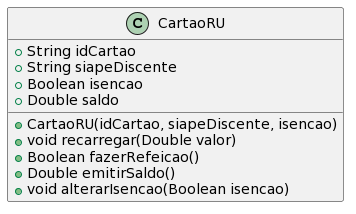

# Cartão RU Simples

A idea desta atividade é que você seja capaz de implementar as funcionalidades
básicas de um cartão do RU.

- [Requisitos](#requisitos)
- [Diagrama](#diagrama)
- [Exemplo de execução](#exemplo-de-execução)

## Requisitos

- Cartão
  - Um cartão do RU (Restaurante Universitário) simples guarda o saldo em reais de um discente
  - O cartão precisa aceitar operações de Recarga, Lançar Refeição, e emitir saldo atual
- Inicialização
  - O saldo inicial deve ser 0.00
  - Cartão precisa de um número de identificação, e número do matrícula do discente, e a informação se o discente possui isenção ou não.
  - Matrícula não pode ser modificada apos criação do cartão
  - A condição de isenção pode ser modificada
- Fazer Refeição
  - Não deve ser possível deixar um saldo negativo
  - Cada refeição custa 1.10 para não isentos
  - Isentos não são debitados, mas precisa usar o cartão
- Recarga
  - Não deve ser possível depositar um valor negativo ou zero.
  

## Diagrama



## Criando sua primeira classe em Java 

Veja as seções 4.2 a 4.6 da Apostila de Java da Alura (https://www.caelum.com.br/apostila/apostila-java-orientacao-objetos.pdf)

## Exemplo de execução 

**TAREFA**: Implementar uma classe CartaoRU que atenda os requisitos, conforme o diagrama e o código de teste abaixo.

```java
public class Runner {

    public static void main(final String[] args) {

        CartaoRU meuCartao = new CartaoRU("001", "123456", false);
        System.out.println("saldo esperado = 0.0, atual = " + meuCartao.emitirSaldo());

        Boolean resultado = meuCartao.fazerRefeicao();
        if(resultado){
          System.out.println("erro - Refeição liberada. Saldo restante = " + meuCartao.emitirSaldo());
        } else {
          System.out.println("esperado - Refeição recusada. Saldo atual = " + meuCartao.emitirSaldo());
        }

        meuCartao.recarregar(2.00);
        resultado = meuCartao.fazerRefeicao();
        if(resultado){
          System.out.println("esperado - Refeição liberada. Saldo restante = 0.90, atual = " + meuCartao.emitirSaldo());
        } else {
          System.out.println("erro - Refeição recusada. Saldo atual = " + meuCartao.emitirSaldo());
        }

        resultado = meuCartao.fazerRefeicao();
        if(resultado){
          System.out.println("erro - Refeição liberada. Saldo restante = " + meuCartao.emitirSaldo());
        } else {
          System.out.println("esperado - Refeição recusada. Saldo esperado = 0.90, atual = " + meuCartao.emitirSaldo());
        }        

        CartaoRU meuCartao2 = new CartaoRU("002", "654321", true);
        
        meuCartao2.recarregar(1.10);
        
        resultado = meuCartao2.fazerRefeicao();
        if(resultado){
          System.out.println("esperado - Refeição liberada. Saldo esperado = 1.10, atual = " + meuCartao2.emitirSaldo());
        } else {
          System.out.println("erro - Refeição recusada (deveria permitir para isentos)");
        }
                
        meuCartao2.alterarIsencao(false);
        resultado = meuCartao2.fazerRefeicao();
        if(resultado){
          System.out.println("esperado - Refeição liberada. Saldo esperado = 0.0, atual = " + meuCartao2.emitirSaldo());
        } else {
          System.out.println("erro - Refeição recusada.");
        }        


    }
}
```
