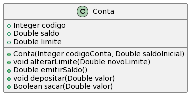

# Conta Bancária Simples

A idea desta atividade é que você seja capaz de implementar as funcionalidades
básicas de uma conta bancária.

- [Requisitos](#requisitos)
- [Diagrama](#diagrama)
- [Exemplo de execução](#exemplo-de-execução)

## Requisitos

- Conta
  - Uma conta bancária simples guarda o saldo em reais de um correntista
  - A conta precisa aceitar operações de saque, depósito, alteração de limite, e emitir saldo atual
- Inicialização
  - O valor inicial do limite deve ser 100.00
  - Conta precisa de um número de identificação e um saldo inicial ao ser criada
- Saldo
  - O saldo da conta é igual ao saldo mais o limite
- Saques
  - Não deve ser possível sacar um valor negativo ou zero
  - Não deve ser possível sacar um valor que exceda o limite da conta (saldo + limite)
- Depósitos
  - Não deve ser possível depositar um valor negativo ou zero.
  

## Diagrama



## Criando sua primeira classe em Java 

Veja as seções 4.2 a 4.6 da Apostila de Java da Alura (https://www.caelum.com.br/apostila/apostila-java-orientacao-objetos.pdf)

## Exemplo de execução 

**TAREFA**: Implementar uma classe Conta que atenda os requisitos, conforme o diagrama e o código de teste abaixo.

```java
public class Runner {

    public static void main(final String[] args) {

        Conta minhaConta = new Conta(1001, 200.0);
        System.out.println("saldo esperado = 300, atual = " + minhaConta.emitirSaldo());

        minhaConta.sacar(250.0);
        System.out.println("saldo esperado = 50, atual = " +  minhaConta.emitirSaldo());

        if(minhaConta.sacar(51.0)){
            System.out.println("erro = Saque autorizado");
        } else {
            System.out.println("esperado = Saque não autorizado");
        }

        minhaConta.depositar(500);
        System.out.println("saldo esperado = 550, atual = " + minhaConta.emitirSaldo()); 

        if(minhaConta.sacar(150)){
            System.out.println("esperado = Saque autorizado"); 
        } else {
            System.out.println("erro = Saque não autorizado"); 
        }
        
        minhaConta.alterarLimite(50.0);
        System.out.println("saldo esperado = 350, atual = " + minhaConta.emitirSaldo());
        
        if(minhaConta.sacar(400.50)){
            System.out.println("erro = Saque autorizado"); 
        } else {
            System.out.println("esperado = Saque não autorizado"); 
        }

        minhaConta.depositar(50);
        System.out.println("saldo esperado = 400, atual = " + minhaConta.emitirSaldo());
    }
}
```
